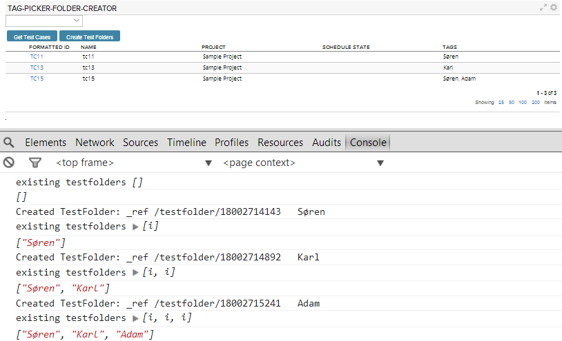

Create TestFolders based on Tags of TestCases
=========================

## Overview
1. Select tags from the tag picker
2. Click on "Get Test Cases" to buid a grid
3. Click on "Create Test Folders".
TestFolders with Name identical to the Name of respective Tags are created. Duplicates are not allowed. If a TestFolder with a specific Name already exists, a duplicate is not created.

This app comes AS IS. It is not supported by Rally support.
## License

AppTemplate is released under the MIT license.  See the file [LICENSE](https://raw.github.com/RallyApps/AppTemplate/master/LICENSE) for the full text.
